# ClassicOS 2000 Icon Theme

Scalable Linux Desktop Icon Theme modeled after Windows 2000.

## Note

Version 2 of the icon theme is currently in the works, sporting a new build system and more 24px icons, among other improvements.

## Installation

Requires bash for build & installation.
Generating PNG or ICO files also requires inkscape and imagemagick's `convert` program.

### Freedesktop Icon Theme

```bash
make freedesktop
make install
# for system-wide installation, use 'sudo make install'
# or set the PREFIX environment variable to a different prefix:
# PREFIX=/usr/local/share make install
```

### Generate PNG Files

```bash
make png
```

### Generate PNG and ICO files

```bash
make ico
```

## Screenshots

### In Use (Nemo on GNOME 40)

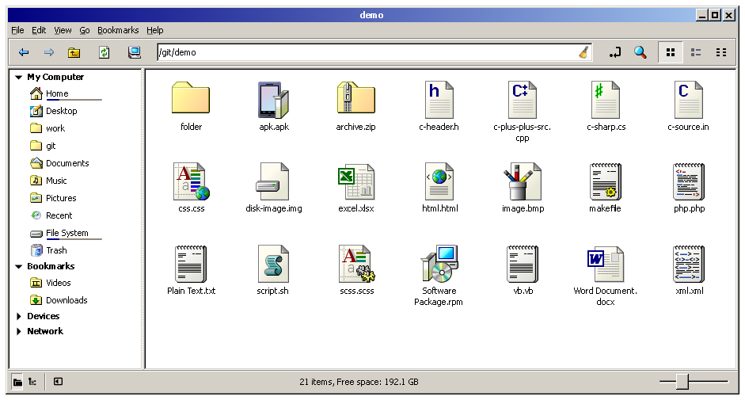

[16px](screenshots/16px-files.png) [32px](screenshots/32px-files.png) [48px](screenshots/48px-files.png) [oversize](screenshots/oversize-files.png)

### Misc. Icons

48px @2x: 
        

48px @1x: 
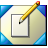   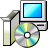 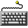 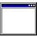 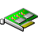   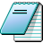 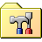  

32px @1x: 
  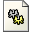 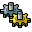        

16px @1x: 
  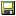  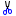               

## Misc Notes

Falls back to [98SE](https://github.com/nestoris/Win98SE), [Chicago95](https://github.com/grassmunk/Chicago95), [Windows-XP](https://github.com/B00merang-Artwork/Windows-XP/), [Retrosmart Icons](https://github.com/mdomlop/retrosmart-icon-theme), and [Tango](http://tango.freedesktop.org/Tango_Icon_Library) for missing icons
